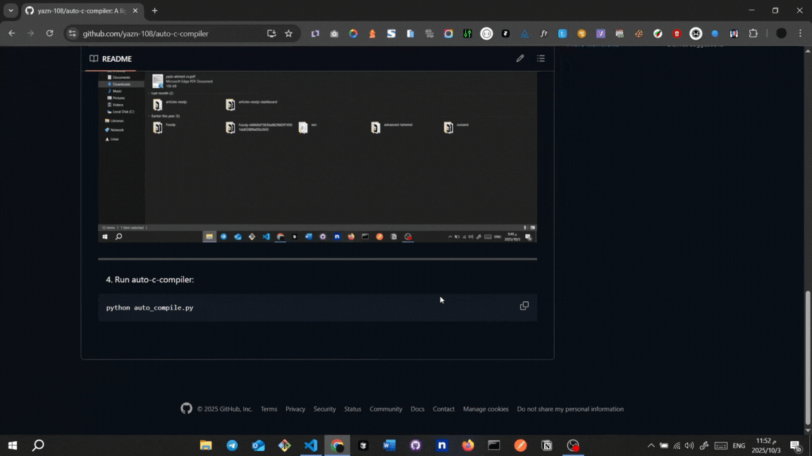

# Auto C Watcher & Runner

A lightweight Python watcher that **auto-compiles** and **runs** C source files whenever they change.  
Designed for quick iterative development and testing on Windows (also works on Linux/macOS with `gcc` installed).

---

## Quick Start

1. install python:

- Go to [Python official downloads](https://www.python.org/downloads/)
- Download the latest stable version for Windows.
- Run the installer. **Check the box "Add Python 3.x to PATH"**.
- Finish the installation.

---

2. Clone repo:

```bash
git clone https://github.com/yazn-108/auto-c-watcher.git
```

---

3. Change windows settings:
   > Sometimes Windows blocks the compiled executable (main.exe) due to SmartScreen or Windows Defender. Follow these steps to allow your project folder safely.


---

4. Run auto-c-watcher:

```bash
python auto_compile.py
```


